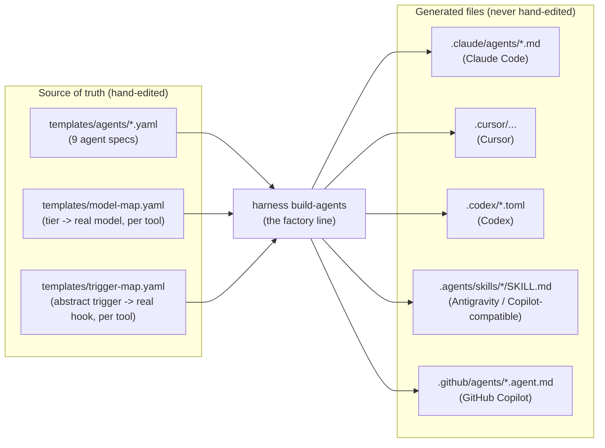
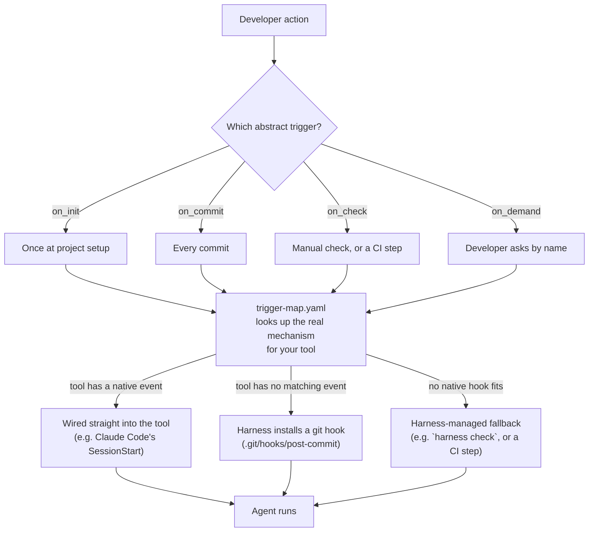

# Factories as Code: how Harness Stack's agents actually work

This page is for developers who have **little or no AI background** and just
want a clear, accurate picture of what Harness Stack does under the hood: what
an "agent" is, how it starts running, and how we keep the whole system honest
over time. No prior AI experience needed — if you can read a YAML file and a
flowchart, you can read this page.

If you want the marketing pitch, read the [README](../README.md). If you want
the full technical design (schema fields, open questions, roadmap), read
[`spec-subagents.md`](./spec-subagents.md). This page sits between the two: it
explains the *shape* of the system.

## The one-sentence version

**You write one small spec file per agent. Harness Stack turns that spec into
the exact file each AI tool needs, for every tool you use, automatically.**

That's "factories as code": instead of hand-writing a Claude Code agent file,
then a separate Cursor rule, then a separate Copilot prompt — all slightly
different, all easy to let drift out of sync — you write **one** `.yaml` file
that says what the agent does, and a build step *manufactures* every
tool-specific file from it. You never hand-edit the generated files. If you
need to change how an agent behaves, you edit its one source spec and
re-run the build. The factory does the rest.

## 1. The build pipeline: from one spec to many files

What this means day to day:

- **You (or `harness init`) hand-write or edit** the files in the "Source of
  truth" box only. Everything in "Generated files" is regenerated from
  scratch every time you run `harness build-agents` — think of it like
  compiled output, not source code.
- **Never edit a generated file directly.** Your edit will silently disappear
  the next time someone runs the build. If a generated file looks wrong, fix
  the *spec* it came from and rebuild.
- **One codebase, every tool.** A team using both Claude Code and Cursor gets
  both sets of generated files from the exact same specs — no risk of the
  Cursor version quietly behaving differently from the Claude Code version
  because someone forgot to update one of them.
- **The specs never mention a real model name or a real hook API.** A spec
  says `model_tier: reasoning`, not `claude-sonnet-5`. `model-map.yaml` and
  `trigger-map.yaml` are the *only* two files that know about actual model
  IDs and actual platform APIs — see §4. That's what makes one spec buildable
  for five different tools.

## 2. How an agent actually starts running (activation & triggers)

Every agent declares one or more abstract `triggers` in its spec — not a real
hook, just a plain-English *moment*:

| Abstract trigger | Fires... |
|---|---|
| `on_init` | Once, when a project is first set up (`harness init`) |
| `on_commit` | Every time a commit is made |
| `on_check` | On demand, or wired into CI, as a verification gate |
| `on_demand` | Only when a developer explicitly asks for it |

`harness init` resolves each abstract trigger to whatever mechanism your
chosen tool actually supports, using `templates/trigger-map.yaml` as the
lookup table:

In plain terms: **as a developer, you never wire anything by hand.**
`harness init` asks which tool(s) you use once, then does all the plumbing —
including, where needed, installing a small git hook for you so `on_commit`
agents (like `commit-brain-agent`) fire automatically on every commit without
you remembering to run anything. That hook is safe to have alongside your own
existing git hooks: Harness only ever manages its own clearly-marked block
inside the hook file and leaves the rest of it untouched.

## 3. The v1 agent roster

These nine agents ship today. Each one does exactly one job — that's
deliberate: a small, single-purpose agent is easier to trust, easier to
review the spec for, and easier to swap out than one giant "do everything"
assistant.

| Agent | Trigger(s) | What it does | Can it write files? |
|---|---|---|---|
| `harness-init-agent` | `on_init` | Detects your project type, reports what harness pieces are missing, and scaffolds them after you say yes. | Yes |
| `spec-author-agent` | `on_init`, `on_demand` | Drives spec-driven planning (via Spec Kit): constitution → spec → plan → tasks. Stops before writing code. | Yes (specs/docs only) |
| `skills-router-agent` | `on_demand` | Given a task, recommends the most relevant skills from all your installed sources — never runs one without your OK. | No (read-only) |
| `mcp-router-agent` | `on_demand` | Recommends the most relevant MCP servers (external tool connectors) for a task from a curated, vetted list. | No (read-only) |
| `commit-brain-agent` | `on_commit` | On every commit, writes a short "what changed and why" entry to your team's shared memory log (harness-brain). Never blocks the commit, even on error. | Yes |
| `dependency-audit-agent` | `on_init`, `on_demand` | Keeps a `DEPENDENCIES.md` file current: which packages are outdated, deprecated, or past end-of-life — using live data, never guesses. | Yes (one file only) |
| `test-author-agent` | `on_demand`, `on_check` | Reviews your test coverage and quality, and — only with your consent — writes the missing tests. | Yes (tests only, never production code) |
| `drift-reviewer-agent` | `on_check`, `on_demand` | Compares a change against its docs/comments and flags (or, with consent, fixes) anything that's gone stale. | Yes (docs only, never behavior) |
| `verifier-agent` | `on_check`, `on_demand` | The independent judge: confirms a change is actually covered by *passing* tests. Cannot write tests itself — it has to ask `test-author-agent` — so it can never grade its own homework. | No (read + run tests only) |

Two agents are deliberately paired as a check-and-balance: `verifier-agent`
(the "did we actually test this?" judge) and `drift-reviewer-agent` (the "did
the docs keep up?" judge) run in parallel on every `on_check`, each covering
half of what "done" means for a change.

More agents are planned but not built yet — see the Phase 2/3 roadmap in
[`spec-subagents.md`](./spec-subagents.md). We don't document unbuilt agents
here to avoid describing behavior that doesn't exist yet.

## 4. Why nothing here mentions a specific model or a specific hook

Two small files carry *all* the tool-specific and time-sensitive knowledge, so
the nine agent specs above never have to:

- **`templates/model-map.yaml`** — maps an abstract `model_tier` (`fast`,
  `reasoning`, `deep`) to a real model name, per tool. Model line-ups change
  every few months; when they do, you edit this one file, not nine specs.
- **`templates/trigger-map.yaml`** — maps an abstract trigger to the real
  hook/event for each tool, and marks each mapping `verified: true/false`.
  `false` means "this is our best guess — `harness-init-agent` is required to
  double-check it against that tool's *current* docs before relying on it,"
  because these APIs drift and a stale guess baked into a spec would fail
  silently months later.

This separation is what makes "one spec, every tool" possible, and it's why
you should never need to hardcode a model name or a hook name anywhere else.

## 5. Keeping this honest: evals, benchmarks, and self-improvement

A factory that manufactures things nobody checks isn't trustworthy. Harness
Stack has started building that checking layer directly into the pipeline,
instead of leaving agent quality to "looks fine on review":

- **`npm run eval:agents`** runs a small, fast, dependency-light benchmark
  against every shipped agent spec in `templates/agents/*.yaml` — before it
  ever reaches a developer's machine. It catches the kind of mistake that's
  easy to make by hand and easy to miss in review: a prompt that's
  accidentally empty or still has a `TODO` in it, a capability that doesn't
  exist, a trigger that isn't wired to anything, an agent whose declared
  capabilities contradict its own design (like a `verifier` that can write —
  defeating the whole point of having an independent judge). This runs
  automatically in CI, on every pull request, on Linux, macOS, *and*
  Windows — nobody has to remember to run it by hand.
- This is deliberately a **starting point, not a finish line**. Today's checks
  are about spec *hygiene* (does the spec make sense on its face) rather than
  output *quality* (is what the agent actually produces any good). The
  natural next rungs on this ladder, tracked as future work:
  - **Output-quality evals** — running each agent against a small set of
    realistic scenarios and scoring the result, using an open-source eval
    runner (e.g. [Promptfoo](https://www.promptfoo.dev/)) rather than
    hand-inspecting transcripts.
  - **A feedback loop from harness-brain** — `commit-brain-agent` already
    writes a dated, human-readable log of what every agent did and why (see
    the sibling [harness-brain](https://github.com/exponen-agi/harness-brain)
    repo). That log is a ready-made source of real-world successes and
    failures; the next step is mining it to catch regressions automatically,
    closing the loop from "an agent misbehaved in production" back to "the
    spec that caused it gets fixed."

Until then, `npm run eval:agents` is the cheapest, most reliable thing a small
team can lean on: it's checked into CI, requires no extra account or API key,
and fails loudly and specifically instead of shipping a broken agent quietly.

## 6. Running any of this on Mac, Windows, or Linux

Everything described on this page — `harness build-agents`, `harness init`,
`npm run eval:agents`, the CI checks — is plain Node.js and runs identically
on macOS, Linux, and Windows. A couple of specific notes:

- **The `on_commit` git hook** Harness installs starts with `#!/bin/sh`. That
  looks like a Unix-only shebang, but it isn't: Git for Windows ships its own
  bundled `sh.exe` (Git Bash), and Git always runs hook scripts through it —
  even on Windows, even if you never open a terminal yourself. You don't need
  WSL or a separate shell install for this to work.
- **Windows PATH issues with global npm installs** are the single most common
  install-time snag — see the Troubleshooting section of the
  [README](../README.md) for the exact fix if `harness` isn't found after
  installing.
- Every script under `scripts/` in this repo (`eval-agents.mjs`,
  `check-brain-template.mjs`, `prepare.mjs`) is plain Node, no Bash-only
  syntax, no `chmod +x` required — run any of them through its `npm run`
  script (e.g. `npm run eval:agents`) and it works identically on any OS.
  `eval-agents.mjs` specifically imports the agent schema straight from
  `src/` (not the compiled `dist/`) so it always checks against the code
  that's about to ship, which means it needs `tsx` rather than plain `node`
  — `npm run eval:agents` already wires that up.
- Our own CI (`.github/workflows/ci.yml`) runs the full test/lint/build/eval
  chain on `ubuntu-latest`, `macos-latest`, *and* `windows-latest` for every
  pull request — so "works on my machine" gets caught before it ships.
