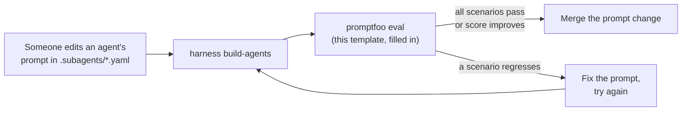

# Output-quality evals (starter template)

`npm run eval:agents` (this repo's own CI check) only checks that an agent
**spec file** is well-formed: no empty prompt, no leftover `TODO`, no
contradiction like a `verifier` agent that can write files. It never checks
whether an agent's actual *output* — the thing it says or does when you run
it — is any good. This folder is a starting point for that second, harder
question, as described in
[`docs/factories-as-code.md` §5](../../docs/factories-as-code.md#5-keeping-this-honest-evals-benchmarks-and-self-improvement).

## Why this isn't wired into `npm test` or CI

Checking an agent's *output* means calling a real model, which needs your own
API key and costs real money per run. This repository has no model
credentials to run it with, so it stays a template you copy into your own
project and run yourself — locally, or in your own project's CI once you've
added your own secret.

This repo's own CI instead runs two credential-free layers: `npm run
eval:agents` (spec hygiene) and the golden-file build benchmark
(`tests/build-snapshot.test.ts`, run by `npm test`), both described in
[`docs/factories-as-code.md` §5](../../docs/factories-as-code.md#5-keeping-this-honest-evals-benchmarks-and-self-improvement).
Neither calls a model, so neither can catch a bad *response* — only a bad
*spec* or a bad *compile*.

## A credential-free middle tier, if you want one before paying for tokens

Promptfoo itself doesn't require a model call for every assertion. Two
mechanisms are worth knowing before you reach for `llm-rubric` (which does):

- **Deterministic assertions** — `contains`, `equals`, `regex`, `is-json`,
  `javascript`, `python`, and others check the *shape* of a response with
  plain code, no model involved, so they cost nothing and never flake.
- **The `exec:` provider** runs a local command (e.g. this repo's own
  `harness build-agents`, or a small wrapper script) as the "model under
  test" and asserts on its stdout — useful for checking a generated file's
  *shape* (front matter present, no leftover template placeholder, expected
  section headers) without ever calling a real model.

Reach for a real, paid `llm-rubric` provider (as `promptfooconfig.yaml` in
this folder does today) only once you actually need to judge *meaning* —
"did the agent refuse the out-of-scope request," not just "is the output
valid YAML." Mixing both tiers in one config file is fine — Promptfoo only
calls a model for the assertions that ask for one.

## What's here

- **`promptfooconfig.yaml`** — a minimal, runnable
  [Promptfoo](https://www.promptfoo.dev/) config. Promptfoo was picked
  because it needs no Python/ML stack, no separate service to run, and no
  code — just this one YAML file and a CLI command.
- **`system-prompt.example.txt`** — an empty placeholder. Copy the `prompt:`
  field out of the real agent spec you want to test (from your project's
  `.subagents/<agent-name>.yaml`) and paste it in here. We deliberately don't
  ship a real prompt's text pre-filled in this template: that would be a
  second copy of the same content living in two files, which is exactly the
  kind of drift "factories as code" (see the parent doc) exists to prevent.

## How to run it

You don't need to install anything permanently — `npx` fetches Promptfoo on
demand and works the same on macOS, Linux, and Windows:

```bash
# 1. Fill in system-prompt.example.txt with the agent prompt you want to test
#    (or point promptfooconfig.yaml's `system_prompt` var at your own file).
# 2. Set whichever API key your chosen provider needs, e.g.:
export ANTHROPIC_API_KEY=sk-...          # macOS / Linux
# $env:ANTHROPIC_API_KEY = "sk-..."      # Windows PowerShell

# 3. Run the eval:
npx promptfoo@latest eval -c templates/evals/promptfooconfig.yaml

# 4. Look at the results in your terminal, or open the local results viewer:
npx promptfoo@latest view
```

Edit `providers` in `promptfooconfig.yaml` to point at whatever model you
resolved for that agent's `model_tier` in `templates/model-map.yaml` — the
eval is only meaningful if it tests the same model the agent actually runs
on.

## Growing this into a self-improvement loop

Once you have a handful of scenarios like this passing reliably, the natural
next step (still manual today, tracked as future work in
`docs/factories-as-code.md`) is:



The gate is what makes it "self-improvement" rather than "self-guessing": a
prompt change only ships once it's shown, against a fixed set of scenarios,
to be at least as good as what it's replacing — never on vibes alone.
